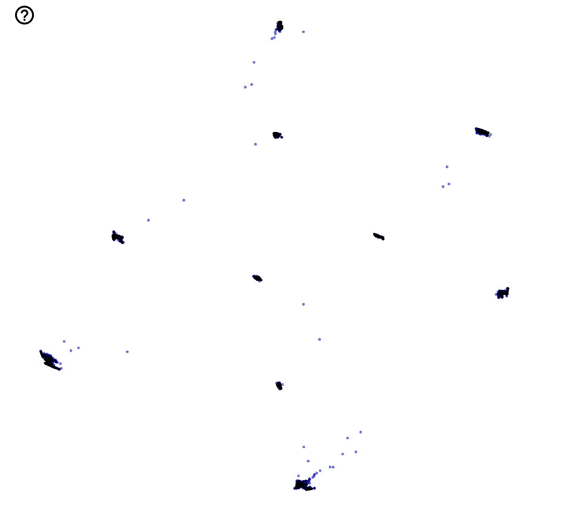

# Deep Embedding Clustering (DEC) in Tensorflow
Tensorflow implementation of [Unsupervised Deep Embedding for Clustering Analysis][dec-arxiv].

## Installation
```sh
>>> pip3 install -r requirements.txt
```

## Training
```sh
usage: train.py [-h] [--batch-size BATCH_SIZE] [--gpu-index GPU_INDEX]

optional arguments:
  -h, --help            show this help message and exit
  --batch-size BATCH_SIZE
                        Train Batch Size
  --gpu-index GPU_INDEX
                        GPU Index Number
```

## Visualize
The `inference.py` returns the latent representation ($z$), and exports the `z.tsv`, `meta.tsv` (label information).
```sh
usage: inference.py [-h] [--gpu-index GPU_INDEX]

optional arguments:
  -h, --help            show this help message and exit
  --gpu-index GPU_INDEX
                        GPU Index Number
```
For visualization, we use t-SNE by importing `z.tsv`, `meta.tsv` into [Tensorboard][tensorboard-url].
The visualization using MNIST shows as follow.

<p align="center">
  
</p>

[dec-arxiv]: https://arxiv.org/pdf/1511.06335.pdf
[tensorboard-url]: https://projector.tensorflow.org
